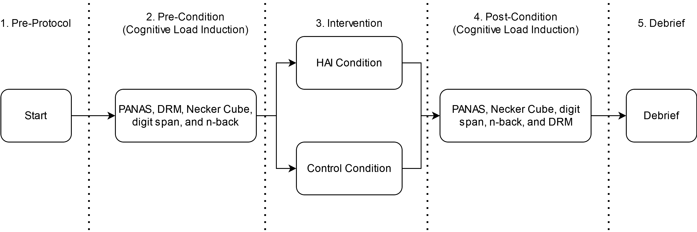
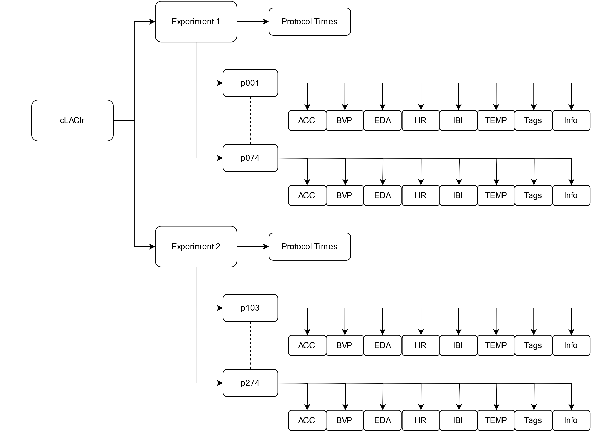

# Cognitive Load and Canine Intervention Recognition Dataset

In [Thayer & Stevens (2021)](https://www.apa-hai.org/haib/download-info/effects-of-human-animal-interactions-on-affect-and-cognition/), we conducted two experiments investigating the effects of human-animal interaction (HAI) on affect and cognition. In these experiments, participants experienced cognitive (working memory, attentional control) tasks before and after either a three-minute exposure to a dog (HAI condition) or a control task. Self-report measures of affect (mood, anxiety, stress) were collected repeatedly throughout the sessions. While interacting with a dog influenced measures of affect, they did not influence cognition. In addition to the affect and cognition measures, participants wore an [Empatica E4](https://www.empatica.com/research/e4/) to record heart rate, electrodermal activity, body temperature, etc. However, we did not analyze these data, as the sampling rate was too low for robust measures of heart rate variability ([Malik et al. 1996](https://doi.org/10.1093/oxfordjournals.eurheartj.a014868), [Laborde et al. 2017](https://doi.org/10.3389/fpsyg.2017.00213)).  That physiological dataset is presented here as the Cognitive Load and Canine Intervention Recognition dataset.

The protocol consisted of five stages: start, cognitive load induction, intervention, cognitive load induction, and debrief, as shown below.  These tasks were performed while an Empatica E4 was worn on the left wrist.

This was performed for 140-participants across two experiments, yielding 95.8 hours of collected physiological data.  The structure of the CLACIR dataset is shown below.  The two experiments are separated into two folders with each participant (labeled pxxx where xxx is replaced with their ID) having seven CSV files and one text file.  The CSV files are the raw data from the Empatica E4, where each observation has a UTC timestamp.  Each experiment has their own protocol times that provides the timestamp for the beginning of each protocol step for each participant. The demographic and survey data is also included for each experiment.

Two Python scripts are included to replicate our results, with an associated requirements.txt file providing the packages needed to setup a Python virtual environment.  We used Python 3.9 for our own setup.  The steps to reproduce are:

1. Clone this repository to a local directory,
2. Create a Python 3.9 virtual environment,
3. Install all packages using the requirements.txt file,
4. Run clacir_benchmarking.py

The script will automatically process the raw dataset, create directories for derived data and figures, and perform the machine learning tests.  

Our preregistration information can be found in the Admin folder of this repository.